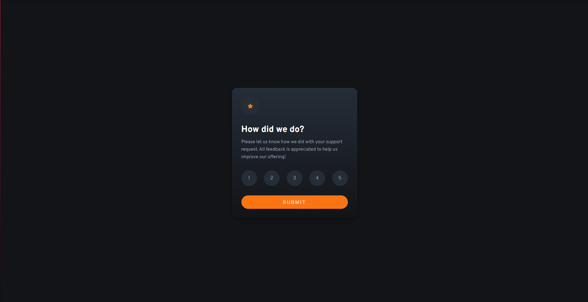
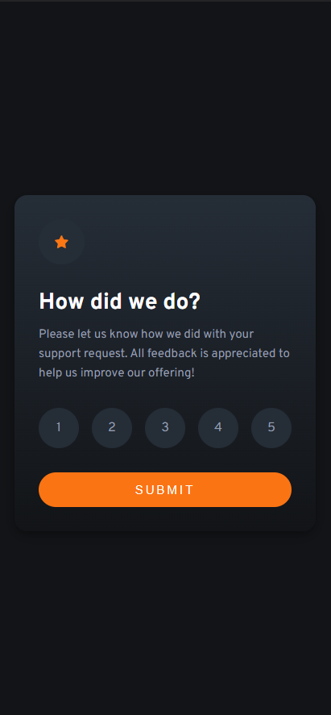

# Frontend Mentor - Interactive rating component solution

This is a solution to the [Interactive rating component challenge on Frontend Mentor](https://www.frontendmentor.io/challenges/interactive-rating-component-koxpeBUmI). Frontend Mentor challenges help you improve your coding skills by building realistic projects.

[Solution][solution-url] . [Live Page][live-page]

Table of contents

-   [Overview](#overview)
    -   [The challenge](#the-challenge)
    -   [Screenshots](#screenshots)
    -   [Links](#links)
-   [My process](#my-process)
    -   [Built with](#built-with)
    -   [Useful resources](#useful-resources)
-   [Author](#author)

## Overview

### The challenge

Users should be able to:

-   View the optimal layout for the app depending on their device's screen size
-   See hover states for all interactive elements on the page
-   Select and submit a number rating
-   See the "Thank you" card state after submitting a rating

### Screenshots

<table>
        <tr>
            <td>
                
            </td>
            <td>
                
            </td>
        </tr>
</table>

### Links

-   [Solution][solution-url]
-   [Live Page][live-page]

## My process

### Built with

-   Semantic HTML5 markup
-   CSS custom properties
-   Flexbox

(<a href="#top">back to top</a>)

### Useful resources

-   [Form](https://stackoverflow.com/questions/21397743/passing-html-input-value-as-a-javascript-function-parameter)
-   [Radio Input](https://stackoverflow.com/questions/45259139/how-to-put-text-inside-radio-button)
-   [Putting text inside Input](https://codepen.io/w3programmings/pen/zzRKpy)

(<a href="#top">back to top</a>)

## Author

-   Frontend Mentor - [link](https://www.frontendmentor.io/profile/JCzyszczon)

(<a href="#top">back to top</a>)

[live-page]: https://jczyszczon.github.io/interactive-rating-component/
[solution-url]: https://www.frontendmentor.io/solutions/responsive-interactive-rating-component-IH9xZTW7kw
